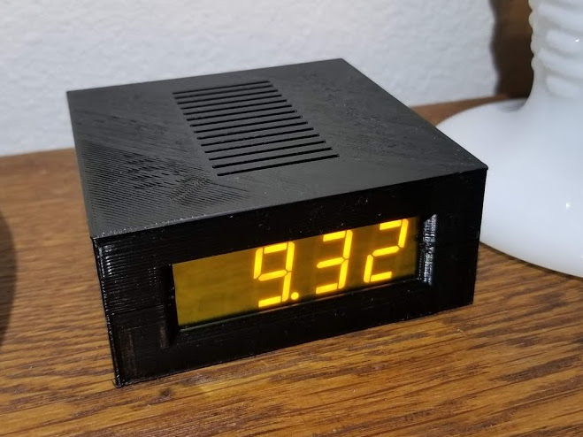
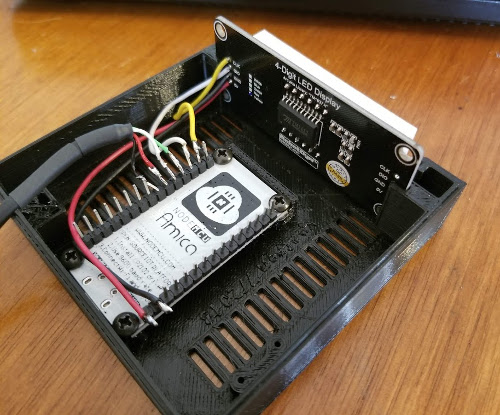

# EnviroClock

In this project, I have add a simple 4-digit 7-segment LED display to an ESP8266 running as an MQTT client to make a clock sending temperature and humidity readings.

## Features

* Publishes MQTT messages every few minutes for home automation/IoT
* Low power. Any lousy USB charger can provide the 200 mA it needs.
* Big, long-life display shows time, temperature and humidity
* Displays IP address after connecting to WiFI
* Automatic time setting via NTP internet server
* Written in MicroPython. Over-the-air control and firmware update.

## Details

A more complete writeup is on my blog at [https://vince.patronweb.com](https://vince.patronweb.com/2018/08/15/esp8266-wifi-clock-temperature-humidity/)

## Photos

